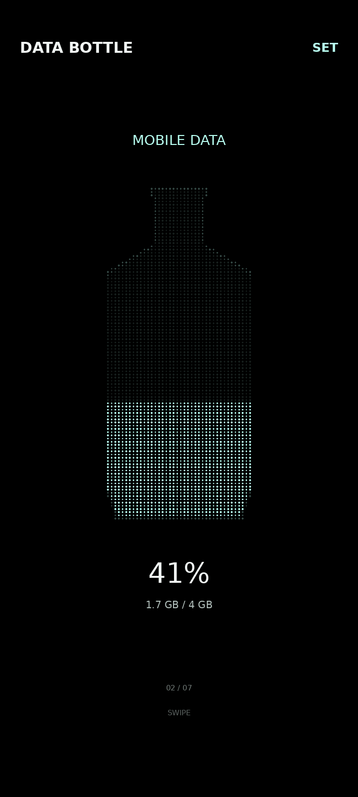

# DATA BOTTLE

**データを、液体として見る。**  
DATA BOTTLE は、スマホの状態やサービスの使用量を高密度ドットの「液体」に変換して表示する Android アプリです。
端末を傾けると液面が重力に追従し、動かしている間は波が生まれ、静止するとピクセル単位で完全に整った水面へ戻ります。

<p align="center">
  
</p>

<p align="center">
  <a href="https://github.com/Masato-Nasu/DATA-BOTTLE/releases/download/v0.1.7/DATA-BOTTLE-v0.1.7-release.apk"><strong>Download signed APK — v0.1.7</strong></a>
</p>

## v0.1.7 — pixel-flat rest surface

- **静止時:** 波とメニスカスをゼロにし、微小なセンサー角度ノイズを丸めます。
- **完全な水平面:** 端末がほぼ正立して静止したとき、液量表示を最寄りの完全なドット行へ丸めます。
- **数値は正確:** 見た目だけを最大約半行ぶん丸め、`41%` や `1.7 GB / 4 GB` などの数値は実測値を表示します。
- **動作時:** 最大約4.5ドットの主波＋弱い副波で、はっきりした液体感を出します。
- **有機的な揺れ:** 新しいスロッシュごとに位相・副波比率・速度・振幅をわずかに変え、機械的なループ感を抑えます。
- **静止Widget:** ホーム画面ウィジェットも完全な水平ドット行へスナップします。

## Bottle types

- **BATTERY** — 電池残量
- **STORAGE** — 端末ストレージ使用率
- **MEMORY** — RAM使用率
- **MOBILE DATA** — 月間モバイルデータ使用量 / 契約容量
- **OPENAI API** — 当月APIコスト / 月間上限（BYOK）
- **BRIGHTNESS** — 画面輝度
- **VOLUME** — メディア音量

左右スワイプでボトルを切り替え、**SET** から表示 / 非表示と順番を変更できます。

## Data = liquid

明るいドットがデータ、暗いドットが空き領域です。液体の点灯量はデータ値から決まり、端末を動かしている間は重力方向と慣性に応じて水面が変形します。

静止状態では視覚的な安定を優先します。端末が正立に近い場合は重力方向の微小ノイズをカード方向へスナップし、さらに液量を最寄りの完全なドット行へ丸めることで、**一切ギザつかない水平な水面**を作ります。

## 100% overflow

MOBILE DATA と OPENAI API は100%を超えても同じボトルで表現します。

- 75% → 通常色が底から75%
- 115% → 通常色で満水後、超過色が底から15%ぶん置き換える
- 180% → 下80%が超過色
- 230% → 超過色で満水後、通常色が底から30%ぶん置き換える

## Android permissions

DATA BOTTLE は、必要以上の端末権限を要求しない方針で作っています。現在の `AndroidManifest.xml` で宣言している権限は次の2つです。

### Internet access

```text
android.permission.INTERNET
```

OPENAI API ボトルで OpenAI のAPIへ接続するために使用します。

BATTERY / STORAGE / MEMORY / BRIGHTNESS / VOLUME など、端末内だけで取得できるデータの表示そのものにインターネット通信は必要ありません。

### Usage access

```text
android.permission.PACKAGE_USAGE_STATS
```

**MOBILE DATA** ボトルで端末全体のモバイル通信量を取得するために使用します。

この権限は通常のポップアップ型許可ではなく、ユーザー自身がAndroidの設定画面から **「使用状況へのアクセス」** をDATA BOTTLEに許可する必要があります。

DATA BOTTLEでは次の手順で設定できます。

```text
SET → MOBILE DATA → GRANT
```

Androidの設定画面が開いたら、**DATA BOTTLE** の使用状況アクセスを許可してください。

許可しない場合でもアプリ自体は利用できます。**MOBILE DATAの自動取得だけが利用できません。**

### Accelerometer

DATA BOTTLEは、端末を傾けたときにデータの液面を重力方向へ動かすため、加速度センサーを使用します。

Manifestでは次の端末機能を任意機能として宣言しています。

```text
android.hardware.sensor.accelerometer
```

`required="false"` のため、加速度センサーを必須条件にはしていません。また、加速度センサー利用のためにユーザーへ追加の実行時権限ダイアログを表示することはありません。

### Permissions not requested

現在のDATA BOTTLEは、次の権限を要求していません。

- カメラ
- マイク
- 位置情報
- 連絡先
- SMS
- 通話履歴
- 写真 / 動画ライブラリへのアクセス

つまり通常利用では追加許可をほとんど必要とせず、特別な設定が必要なのは主に **MOBILE DATAの「使用状況へのアクセス」** です。

## MOBILE DATA

端末全体のモバイル通信量を取得するには Android の「使用状況へのアクセス」が必要です。
アプリ内の **SET → MOBILE DATA → GRANT** から許可してください。

## OPENAI API / BYOK

**SET → OPENAI API · BYOK** で OpenAI Admin API key を入力します。
キーは Android Keystore のAES-GCM鍵で暗号化してアプリ専用領域へ保存し、ソースコードには埋め込みません。

> **重要:** APIキーや `local.properties` をGitへコミットしないでください。このリポジトリにはキーを含めません。

## Build — Windows PowerShell

必要なもの:

- Android SDK 36
- Java 17以上（Android Studio付属JDKでも可）
- インターネット接続（初回のみGradle 8.13を取得）

```powershell
Set-ExecutionPolicy -Scope Process Bypass -Force
Unblock-File .\BUILD_DATA_BOTTLE.ps1
.\BUILD_DATA_BOTTLE.ps1
```

生成APK:

```text
DATA-BOTTLE-v0.1.7-debug.apk
```

配布用の署名済みAPKは GitHub Releases の `DATA-BOTTLE-v0.1.7-release.apk` を使用してください。

## Widget

ホーム画面を長押し → **ウィジェット** → **DATA BOTTLE**。  
最後にアプリで表示していたボトルを静止状態で表示します。

## Package

```text
jp.masatolab.databottle
```
